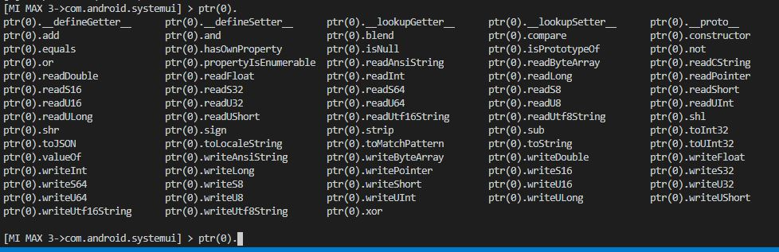
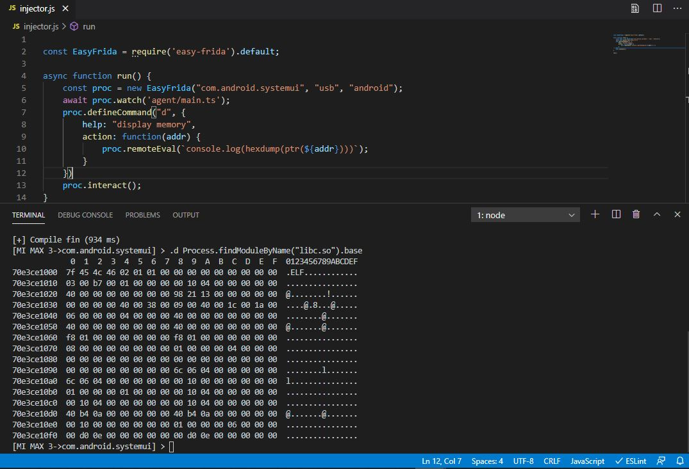

# easy-frida
a tool for easily develop frida agent script/module when reversing  

# feature  

* repl console with auto complete (double click tab)  

notice: when doing this, your typed code will eval in frida env.  

* custom command  

* play with local variables in function  

* many commonly used agent lib functions in fridalib  

# usage  

## install  

    $ git clone https://github.com/tacesrever/easy-frida.git
    $ cd easy-frida/
    $ npm install
    $ npm link
    $ cd agent/dist/
    $ npm install
    $ npm link

## use  

run`create-injector` at empty directory (see `scripts/create-injector.js`)  

open this directory with vscode (or other ide with typescript support)  

edit target in injector.js  

write your frida code in agent/main.ts  

run injector.js with node  