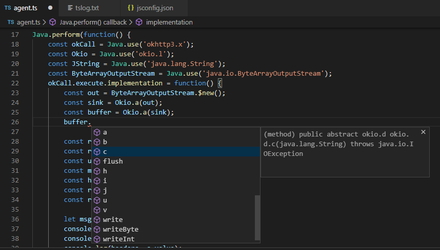

# typescript plugin  
AutoComplete plugin for frida's java warpper.  

# Useage  
add plugin config in tsconfig.json:  

    {
        "compilerOptions": {
            ...
            ,
            "plugins": [{
                "name": path_to_tsplugin,
                "classPaths": [
                    path_to_android_jar(usually at SDKROOT/platforms/android-sdklevel/android.jar),
                    path_to_apk_dex2jar_jar,
                    ...
                ],
                "logfile"?: path_to_logfile
            }]
        }
    }

## for vscode
you should use electron-rebuild to rebuild node-java for electron.  
open vscode, click `Help->About`, then you can see Electron's version,  
then after electron-rebuild has installed,  
run `electron-rebuild -w java -v version_of_electron`  